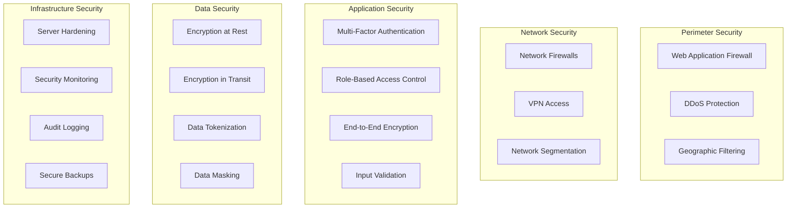

# Security & Compliance Documentation

**Comprehensive Security Framework and Compliance Guide**

## Overview

The Student Pass Management System implements enterprise-grade security measures and maintains compliance with major educational and data protection regulations. This document outlines our comprehensive security architecture, compliance frameworks, and operational security procedures.

## Security Architecture

### Defense in Depth Strategy



### Security Principles

#### 1. Zero Trust Architecture
- **Never Trust, Always Verify**: Every request is authenticated and authorized
- **Least Privilege Access**: Minimal permissions required for functionality
- **Micro-Segmentation**: Network isolation between components
- **Continuous Verification**: Ongoing security posture assessment

#### 2. Privacy by Design
- **Proactive Measures**: Security built into system design
- **Privacy as Default**: Highest privacy settings by default
- **Privacy Embedded**: Security integrated into system architecture
- **Full Functionality**: Security without compromising usability

## Authentication & Authorization

### Multi-Factor Authentication (MFA)

#### Implementation
```typescript
// backend/src/services/mfa.ts
import speakeasy from 'speakeasy';
import QRCode from 'qrcode';

export class MFAService {
  async generateSecret(userEmail: string): Promise<{
    secret: string;
    qrCode: string;
    backupCodes: string[];
  }> {
    const secret = speakeasy.generateSecret({
      name: userEmail,
      issuer: 'Student Pass System',
      length: 32
    });

    const qrCode = await QRCode.toDataURL(secret.otpauth_url);
    const backupCodes = this.generateBackupCodes();

    return {
      secret: secret.base32,
      qrCode,
      backupCodes
    };
  }

  verifyToken(token: string, secret: string): boolean {
    return speakeasy.totp.verify({
      secret,
      token,
      window: 2,  // Allow 2 time steps of variance
      step: 30    // 30-second time step
    });
  }

  private generateBackupCodes(): string[] {
    const codes: string[] = [];
    for (let i = 0; i < 10; i++) {
      codes.push(Math.random().toString(36).substring(2, 10).toUpperCase());
    }
    return codes;
  }
}
```

#### Supported MFA Methods
- **TOTP Applications**: Google Authenticator, Authy, Microsoft Authenticator
- **SMS Authentication**: Fallback method for mobile verification
- **Email Verification**: Secondary authentication channel
- **Backup Codes**: One-time recovery codes
- **Hardware Security Keys**: FIDO2/WebAuthn support (planned)

### Role-Based Access Control (RBAC)

#### Permission Matrix
```yaml
Roles:
  super_admin:
    permissions:
      - "system:*"
      - "users:*" 
      - "schools:*"
      - "applications:*"
      - "passes:*"
      - "analytics:*"
      - "security:*"
    
  school_admin:
    permissions:
      - "users:read,create,update"
      - "students:*"
      - "applications:*"
      - "passes:*"
      - "analytics:school"
    conditions:
      school_scope: "own"
    
  staff:
    permissions:
      - "students:read"
      - "applications:read,update"
      - "passes:read,create"
    conditions:
      school_scope: "own"
      department_scope: "own"
    
  security:
    permissions:
      - "passes:read,verify"
      - "access_logs:read,create"
      - "students:read"
    conditions:
      school_scope: "assigned"
    
  student:
    permissions:
      - "profile:read,update"
      - "applications:create,read"
      - "passes:read"
    conditions:
      data_scope: "own"
```

#### Dynamic Permission Evaluation
```typescript
// backend/src/middleware/authorization.ts
export class AuthorizationService {
  async checkPermission(
    user: User,
    resource: string,
    action: string,
    context?: any
  ): Promise<boolean> {
    const userPermissions = await this.getUserPermissions(user);
    
    for (const permission of userPermissions) {
      if (this.matchesPermission(permission, resource, action)) {
        // Check conditional access
        if (permission.conditions) {
          return this.evaluateConditions(permission.conditions, user, context);
        }
        return true;
      }
    }
    
    return false;
  }

  private evaluateConditions(
    conditions: any,
    user: User,
    context: any
  ): boolean {
    if (conditions.school_scope === 'own' && context?.schoolId !== user.schoolId) {
      return false;
    }
    
    if (conditions.data_scope === 'own' && context?.userId !== user.id) {
      return false;
    }
    
    return true;
  }
}
```

## Data Protection & Encryption

### Encryption Implementation

#### Encryption at Rest
```typescript
// backend/src/utils/encryption.ts
import crypto from 'crypto';

export class FieldEncryption {
  private static readonly ALGORITHM = 'aes-256-gcm';
  private static readonly KEY_LENGTH = 32;
  private static readonly IV_LENGTH = 16;
  private static readonly TAG_LENGTH = 16;

  static encrypt(plaintext: string, key: Buffer): EncryptedData {
    const iv = crypto.randomBytes(this.IV_LENGTH);
    const cipher = crypto.createCipher(this.ALGORITHM, key);
    cipher.setAAD(Buffer.from('student-pass-system'));
    
    let encrypted = cipher.update(plaintext, 'utf8', 'hex');
    encrypted += cipher.final('hex');
    
    const tag = cipher.getAuthTag();
    
    return {
      encrypted,
      iv: iv.toString('hex'),
      tag: tag.toString('hex'),
      algorithm: this.ALGORITHM
    };
  }

  static decrypt(encryptedData: EncryptedData, key: Buffer): string {
    const decipher = crypto.createDecipher(this.ALGORITHM, key);
    decipher.setAAD(Buffer.from('student-pass-system'));
    decipher.setAuthTag(Buffer.from(encryptedData.tag, 'hex'));
    
    let decrypted = decipher.update(encryptedData.encrypted, 'hex', 'utf8');
    decrypted += decipher.final('utf8');
    
    return decrypted;
  }
}

// PII field encryption for database
export class PIIProtection {
  private static readonly SENSITIVE_FIELDS = [
    'ssn', 'dateOfBirth', 'phone', 'address', 'emergencyContact'
  ];

  static async encryptSensitiveFields(data: any): Promise<any> {
    const result = { ...data };
    const encryptionKey = Buffer.from(process.env.FIELD_ENCRYPTION_KEY!, 'hex');
    
    for (const field of this.SENSITIVE_FIELDS) {
      if (result[field]) {
        result[field] = FieldEncryption.encrypt(result[field], encryptionKey);
      }
    }
    
    return result;
  }
}
```

#### TLS Configuration
```nginx
# nginx.conf - SSL/TLS Configuration
ssl_protocols TLSv1.2 TLSv1.3;
ssl_ciphers 'ECDHE-ECDSA-AES128-GCM-SHA256:ECDHE-RSA-AES128-GCM-SHA256:ECDHE-ECDSA-AES256-GCM-SHA384:ECDHE-RSA-AES256-GCM-SHA384:ECDHE-ECDSA-CHACHA20-POLY1305:ECDHE-RSA-CHACHA20-POLY1305:DHE-RSA-AES128-GCM-SHA256:DHE-RSA-AES256-GCM-SHA384';
ssl_prefer_server_ciphers off;
ssl_session_timeout 1d;
ssl_session_cache shared:MozTLS:10m;
ssl_session_tickets off;

# OCSP stapling
ssl_stapling on;
ssl_stapling_verify on;
ssl_trusted_certificate /path/to/root_CA_cert_plus_intermediates;

# Security headers
add_header Strict-Transport-Security "max-age=63072000; includeSubDomains; preload" always;
add_header X-Frame-Options DENY always;
add_header X-Content-Type-Options nosniff always;
add_header X-XSS-Protection "1; mode=block" always;
add_header Referrer-Policy "strict-origin-when-cross-origin" always;
add_header Content-Security-Policy "default-src 'self'; script-src 'self' 'unsafe-inline'; style-src 'self' 'unsafe-inline'; img-src 'self' data: https:; font-src 'self'; connect-src 'self' wss:;" always;
```

### Secure QR Code Implementation

#### Digital Signature & Anti-Tampering
```typescript
// backend/src/services/qrSecurity.ts
import crypto from 'crypto';

export class SecureQRService {
  private static readonly SIGNATURE_ALGORITHM = 'sha256';
  private static readonly QR_VERSION = '2.0';

  static async generateSecureQR(passData: PassData): Promise<string> {
    const payload = {
      version: this.QR_VERSION,
      studentId: passData.studentId,
      passId: passData.passId,
      schoolId: passData.schoolId,
      issueDate: passData.issueDate.toISOString(),
      expiryDate: passData.expiryDate.toISOString(),
      accessLevel: passData.accessLevel,
      timestamp: Date.now(),
      nonce: crypto.randomBytes(16).toString('hex')
    };

    // Create digital signature
    const signature = this.signPayload(payload);
    
    // Create tamper-evident checksum
    const checksum = this.createChecksum(payload);
    
    const securePayload = {
      ...payload,
      signature,
      checksum
    };

    return JSON.stringify(securePayload);
  }

  static async verifyQR(qrData: string): Promise<QRVerificationResult> {
    try {
      const payload = JSON.parse(qrData);
      
      // Verify version compatibility
      if (!this.isVersionSupported(payload.version)) {
        return { valid: false, reason: 'Unsupported QR version' };
      }
      
      // Verify digital signature
      if (!this.verifySignature(payload)) {
        return { valid: false, reason: 'Invalid digital signature' };
      }
      
      // Verify tamper-evident checksum
      if (!this.verifyChecksum(payload)) {
        return { valid: false, reason: 'QR code has been tampered with' };
      }
      
      // Check expiry
      const expiryDate = new Date(payload.expiryDate);
      if (expiryDate < new Date()) {
        return { valid: false, reason: 'Pass has expired' };
      }
      
      // Verify against database
      const pass = await this.verifyPassInDatabase(payload.passId);
      if (!pass || pass.status !== 'active') {
        return { valid: false, reason: 'Pass not found or inactive' };
      }
      
      return {
        valid: true,
        passData: payload,
        metadata: {
          verifiedAt: new Date(),
          version: payload.version
        }
      };
      
    } catch (error) {
      return { valid: false, reason: 'Invalid QR code format' };
    }
  }

  private static signPayload(payload: any): string {
    const secretKey = process.env.QR_SIGNATURE_KEY!;
    const dataToSign = JSON.stringify({
      studentId: payload.studentId,
      passId: payload.passId,
      schoolId: payload.schoolId,
      issueDate: payload.issueDate,
      expiryDate: payload.expiryDate,
      timestamp: payload.timestamp
    });
    
    return crypto
      .createHmac(this.SIGNATURE_ALGORITHM, secretKey)
      .update(dataToSign)
      .digest('hex');
  }

  private static createChecksum(payload: any): string {
    const checksumData = Object.keys(payload)
      .sort()
      .map(key => `${key}:${payload[key]}`)
      .join('|');
    
    return crypto
      .createHash('sha256')
      .update(checksumData)
      .digest('hex')
      .substring(0, 8); // 8-character checksum
  }
}
```

## Input Validation & Sanitization

### Comprehensive Input Validation
```typescript
// backend/src/middleware/validation.ts
import { z } from 'zod';
import DOMPurify from 'isomorphic-dompurify';

// Custom validation schemas
const StudentValidation = z.object({
  firstName: z.string()
    .min(1, 'First name is required')
    .max(100, 'First name too long')
    .regex(/^[a-zA-ZÀ-ÿ\s'-]+$/, 'Invalid characters in first name')
    .transform(name => DOMPurify.sanitize(name.trim())),
    
  lastName: z.string()
    .min(1, 'Last name is required')
    .max(100, 'Last name too long')
    .regex(/^[a-zA-ZÀ-ÿ\s'-]+$/, 'Invalid characters in last name')
    .transform(name => DOMPurify.sanitize(name.trim())),
    
  email: z.string()
    .email('Invalid email format')
    .max(255, 'Email too long')
    .transform(email => email.toLowerCase().trim()),
    
  studentId: z.string()
    .min(3, 'Student ID too short')
    .max(50, 'Student ID too long')
    .regex(/^[a-zA-Z0-9-]+$/, 'Student ID contains invalid characters'),
    
  phone: z.string()
    .regex(/^\+?[1-9]\d{1,14}$/, 'Invalid phone number format')
    .optional(),
    
  dateOfBirth: z.string()
    .datetime('Invalid date format')
    .transform(date => new Date(date))
    .refine(date => {
      const age = (Date.now() - date.getTime()) / (365.25 * 24 * 60 * 60 * 1000);
      return age >= 13 && age <= 100;
    }, 'Invalid age range')
    .optional()
});

// SQL injection prevention
export const preventSQLInjection = (input: string): string => {
  // Remove potential SQL injection patterns
  const dangerous = /('|(\')|;|\*|\%|select|union|insert|update|delete|drop|create|alter|exec|execute)/gi;
  return input.replace(dangerous, '');
};

// XSS prevention
export const sanitizeHTML = (input: string): string => {
  return DOMPurify.sanitize(input, {
    ALLOWED_TAGS: [], // No HTML tags allowed
    ALLOWED_ATTR: [],
    ALLOW_DATA_ATTR: false
  });
};

// Validation middleware
export const validateRequest = (schema: z.ZodSchema) => {
  return async (req: Request, res: Response, next: NextFunction) => {
    try {
      const validatedData = await schema.parseAsync({
        body: req.body,
        query: req.query,
        params: req.params
      });
      
      req.body = validatedData.body;
      req.query = validatedData.query;
      req.params = validatedData.params;
      
      next();
    } catch (error) {
      if (error instanceof z.ZodError) {
        return res.status(400).json({
          error: 'Validation failed',
          details: error.errors.map(err => ({
            field: err.path.join('.'),
            message: err.message,
            code: err.code
          }))
        });
      }
      next(error);
    }
  };
};
```

## Security Monitoring & Incident Response

### Real-Time Security Monitoring

#### Security Event Detection
```typescript
// backend/src/services/securityMonitoring.ts
export class SecurityMonitoringService {
  private alertThresholds = {
    failedLogins: { count: 5, timeWindow: 300000 }, // 5 attempts in 5 minutes
    rapidRequests: { count: 100, timeWindow: 60000 }, // 100 requests in 1 minute
    suspiciousPatterns: { count: 3, timeWindow: 600000 } // 3 patterns in 10 minutes
  };

  async detectAnomalousActivity(event: SecurityEvent): Promise<void> {
    const checks = [
      this.checkFailedLoginAttempts(event),
      this.checkRapidRequests(event),
      this.checkSuspiciousPatterns(event),
      this.checkGeographicAnomaly(event),
      this.checkUnusualAccessTimes(event)
    ];

    const results = await Promise.all(checks);
    const threats = results.filter(result => result.threat);

    if (threats.length > 0) {
      await this.handleSecurityThreat(threats, event);
    }
  }

  private async checkFailedLoginAttempts(event: SecurityEvent): Promise<ThreatAssessment> {
    if (event.type !== 'failed_login') return { threat: false };

    const recentFailures = await this.getRecentEvents(
      'failed_login',
      event.ipAddress,
      this.alertThresholds.failedLogins.timeWindow
    );

    if (recentFailures.length >= this.alertThresholds.failedLogins.count) {
      return {
        threat: true,
        severity: 'high',
        type: 'brute_force_attack',
        description: `${recentFailures.length} failed login attempts from ${event.ipAddress}`,
        recommendedActions: ['block_ip', 'notify_admin', 'require_captcha']
      };
    }

    return { threat: false };
  }

  private async handleSecurityThreat(threats: ThreatAssessment[], event: SecurityEvent): Promise<void> {
    // Immediate response actions
    for (const threat of threats) {
      if (threat.recommendedActions.includes('block_ip')) {
        await this.blockIP(event.ipAddress, threat.severity);
      }
      
      if (threat.recommendedActions.includes('notify_admin')) {
        await this.notifySecurityTeam(threat, event);
      }
      
      if (threat.recommendedActions.includes('require_captcha')) {
        await this.enableCaptchaForIP(event.ipAddress);
      }
    }

    // Log security incident
    await this.logSecurityIncident({
      threats,
      event,
      timestamp: new Date(),
      responseActions: threats.flatMap(t => t.recommendedActions)
    });
  }
}
```

#### Automated Threat Response
```typescript
// backend/src/services/threatResponse.ts
export class ThreatResponseService {
  async executeResponse(threat: ThreatAssessment, event: SecurityEvent): Promise<void> {
    switch (threat.type) {
      case 'brute_force_attack':
        await this.handleBruteForce(event);
        break;
        
      case 'sql_injection_attempt':
        await this.handleSQLInjection(event);
        break;
        
      case 'xss_attempt':
        await this.handleXSSAttempt(event);
        break;
        
      case 'data_exfiltration':
        await this.handleDataExfiltration(event);
        break;
    }
  }

  private async handleBruteForce(event: SecurityEvent): Promise<void> {
    // Block IP address
    await this.firewallService.blockIP(event.ipAddress, '24h');
    
    // Require additional authentication
    await this.userService.requireMFAForUser(event.userId);
    
    // Notify security team
    await this.notificationService.sendSecurityAlert({
      type: 'brute_force_attack',
      severity: 'high',
      details: event
    });
  }
}
```

### Audit Logging

#### Comprehensive Audit Trail
```typescript
// backend/src/services/auditLogger.ts
export class AuditLogger {
  async logSecurityEvent(event: AuditEvent): Promise<void> {
    const auditEntry = {
      id: crypto.randomUUID(),
      timestamp: new Date(),
      eventType: event.type,
      userId: event.userId,
      sessionId: event.sessionId,
      ipAddress: event.ipAddress,
      userAgent: event.userAgent,
      resource: event.resource,
      action: event.action,
      outcome: event.outcome,
      details: event.details,
      riskScore: this.calculateRiskScore(event),
      geolocation: await this.getGeolocation(event.ipAddress),
      deviceFingerprint: this.generateDeviceFingerprint(event)
    };

    // Store in primary audit log
    await this.auditRepository.create(auditEntry);
    
    // Store in tamper-proof log (blockchain or write-only storage)
    await this.tamperProofLogger.append(auditEntry);
    
    // Real-time security monitoring
    await this.securityMonitoring.analyze(auditEntry);
  }

  private calculateRiskScore(event: AuditEvent): number {
    let score = 0;
    
    // Base scores by event type
    const eventScores = {
      'login_failure': 10,
      'admin_action': 15,
      'data_export': 20,
      'permission_change': 25,
      'system_config': 30
    };
    
    score += eventScores[event.type] || 5;
    
    // Location-based risk
    if (event.details?.unusualLocation) score += 15;
    
    // Time-based risk
    if (event.details?.outsideBusinessHours) score += 10;
    
    // Device-based risk
    if (event.details?.newDevice) score += 12;
    
    return Math.min(score, 100);
  }
}

// Audit event types
enum AuditEventType {
  USER_LOGIN = 'user_login',
  USER_LOGOUT = 'user_logout',
  LOGIN_FAILURE = 'login_failure',
  PASSWORD_CHANGE = 'password_change',
  MFA_ENABLE = 'mfa_enable',
  MFA_DISABLE = 'mfa_disable',
  PERMISSION_GRANT = 'permission_grant',
  PERMISSION_REVOKE = 'permission_revoke',
  DATA_ACCESS = 'data_access',
  DATA_MODIFY = 'data_modify',
  DATA_EXPORT = 'data_export',
  ADMIN_ACTION = 'admin_action',
  SYSTEM_CONFIG = 'system_config',
  SECURITY_INCIDENT = 'security_incident'
}
```

## Compliance Frameworks

### FERPA Compliance

#### Family Educational Rights and Privacy Act
```typescript
// backend/src/middleware/ferpaCompliance.ts
export class FERPAComplianceService {
  async validateDataAccess(user: User, studentData: StudentRecord): Promise<boolean> {
    // Educational officials with legitimate educational interest
    if (this.hasLegitimateEducationalInterest(user, studentData)) {
      await this.logEducationalAccess(user, studentData);
      return true;
    }
    
    // Student accessing their own records
    if (user.id === studentData.userId) {
      return true;
    }
    
    // Parent/guardian access (for students under 18)
    if (await this.isParentGuardian(user, studentData)) {
      return true;
    }
    
    // Court order or legal requirement
    if (await this.hasLegalRequirement(user, studentData)) {
      await this.logLegalAccess(user, studentData);
      return true;
    }
    
    return false;
  }

  private hasLegitimateEducationalInterest(user: User, student: StudentRecord): boolean {
    const legitimateRoles = ['school_admin', 'staff', 'counselor', 'teacher'];
    
    return legitimateRoles.includes(user.role) && 
           user.schoolId === student.schoolId &&
           this.hasDirectResponsibility(user, student);
  }

  async handleDataDisclosure(disclosure: DataDisclosure): Promise<void> {
    // Log all disclosures as required by FERPA
    await this.auditLogger.log({
      type: 'ferpa_disclosure',
      studentId: disclosure.studentId,
      disclosedTo: disclosure.recipient,
      purpose: disclosure.purpose,
      dataElements: disclosure.dataElements,
      legalBasis: disclosure.legalBasis,
      timestamp: new Date()
    });

    // Notify student of disclosure (if required)
    if (disclosure.requiresNotification) {
      await this.notifyStudentOfDisclosure(disclosure);
    }
  }
}
```

### GDPR Compliance

#### General Data Protection Regulation
```typescript
// backend/src/services/gdprCompliance.ts
export class GDPRComplianceService {
  async handleDataSubjectRequest(request: DataSubjectRequest): Promise<void> {
    switch (request.type) {
      case 'access':
        await this.handleAccessRequest(request);
        break;
      case 'rectification':
        await this.handleRectificationRequest(request);
        break;
      case 'erasure':
        await this.handleErasureRequest(request);
        break;
      case 'portability':
        await this.handlePortabilityRequest(request);
        break;
      case 'restriction':
        await this.handleRestrictionRequest(request);
        break;
    }
  }

  private async handleAccessRequest(request: DataSubjectRequest): Promise<void> {
    // Gather all personal data
    const personalData = await this.gatherPersonalData(request.subjectId);
    
    // Create portable data package
    const dataPackage = {
      personalData,
      processingPurposes: await this.getProcessingPurposes(request.subjectId),
      dataRetention: await this.getRetentionPeriods(),
      dataRecipients: await this.getDataRecipients(request.subjectId),
      rights: this.getDataSubjectRights(),
      contact: this.getDPOContact()
    };
    
    // Deliver data package securely
    await this.deliverDataPackage(request.subjectId, dataPackage);
    
    // Log compliance action
    await this.logComplianceAction('gdpr_access_request', request.subjectId);
  }

  private async handleErasureRequest(request: DataSubjectRequest): Promise<void> {
    // Verify right to erasure applies
    if (!await this.verifyErasureRights(request)) {
      throw new Error('Right to erasure does not apply');
    }
    
    // Execute erasure across all systems
    await this.erasePersonalData(request.subjectId);
    
    // Notify third parties if data was shared
    await this.notifyThirdPartiesOfErasure(request.subjectId);
    
    // Log erasure action
    await this.logComplianceAction('gdpr_erasure', request.subjectId);
  }

  async conductDataProtectionImpactAssessment(processing: ProcessingActivity): Promise<DPIAResult> {
    const riskFactors = [
      this.assessDataSensitivity(processing.dataTypes),
      this.assessProcessingScale(processing.scope),
      this.assessVulnerability(processing.subjects),
      this.assessTechnologyRisks(processing.technology),
      this.assessLegalCompliance(processing.legalBasis)
    ];

    const riskLevel = this.calculateOverallRisk(riskFactors);
    
    return {
      processing,
      riskLevel,
      riskFactors,
      mitigationMeasures: await this.generateMitigationMeasures(riskFactors),
      requiredApprovals: this.determineRequiredApprovals(riskLevel),
      reviewDate: this.calculateReviewDate(riskLevel)
    };
  }
}
```

### SOC 2 Type II Compliance

#### Service Organization Control 2
```typescript
// backend/src/services/soc2Compliance.ts
export class SOC2ComplianceService {
  private trustServicesCriteria = {
    security: [
      'access_controls',
      'data_protection',
      'network_security',
      'incident_response'
    ],
    availability: [
      'system_monitoring',
      'capacity_management',
      'backup_recovery',
      'change_management'
    ],
    processingIntegrity: [
      'data_validation',
      'error_handling',
      'transaction_processing'
    ],
    confidentiality: [
      'encryption',
      'access_restrictions',
      'data_classification'
    ],
    privacy: [
      'consent_management',
      'data_minimization',
      'retention_policies'
    ]
  };

  async generateSOC2Report(): Promise<SOC2Report> {
    const controls = await this.assessAllControls();
    const exceptions = await this.identifyExceptions();
    const remediation = await this.planRemediation(exceptions);
    
    return {
      reportPeriod: this.getReportPeriod(),
      controls,
      exceptions,
      remediation,
      managementAssertion: await this.generateManagementAssertion(),
      evidence: await this.collectEvidence()
    };
  }

  private async assessControl(controlId: string): Promise<ControlAssessment> {
    const control = await this.getControlDefinition(controlId);
    const evidence = await this.collectControlEvidence(controlId);
    const testing = await this.performControlTesting(controlId);
    
    return {
      controlId,
      description: control.description,
      designEffectiveness: testing.designEffective,
      operatingEffectiveness: testing.operatingEffective,
      exceptions: testing.exceptions,
      evidence,
      testingProcedures: testing.procedures
    };
  }
}
```

### HIPAA Compliance (if applicable)

#### Health Insurance Portability and Accountability Act
```typescript
// backend/src/services/hipaaCompliance.ts
export class HIPAAComplianceService {
  async validatePHIAccess(user: User, phi: ProtectedHealthInformation): Promise<boolean> {
    // Minimum necessary standard
    if (!this.meetsMinimumNecessary(user, phi)) {
      return false;
    }
    
    // Authorization required
    if (!await this.hasValidAuthorization(user, phi)) {
      return false;
    }
    
    // Audit log entry
    await this.logPHIAccess(user, phi);
    
    return true;
  }

  private meetsMinimumNecessary(user: User, phi: ProtectedHealthInformation): boolean {
    const necessaryFields = this.determineNecessaryFields(user.role, user.responsibilities);
    const requestedFields = phi.requestedFields;
    
    return requestedFields.every(field => necessaryFields.includes(field));
  }

  async handleBreachIncident(incident: BreachIncident): Promise<void> {
    // Risk assessment
    const riskAssessment = await this.assessBreachRisk(incident);
    
    if (riskAssessment.requiresNotification) {
      // Notify individuals (within 60 days)
      await this.notifyAffectedIndividuals(incident);
      
      // Notify HHS (within 60 days)
      await this.notifyHHS(incident);
      
      // Notify media if >500 individuals affected
      if (incident.affectedIndividuals > 500) {
        await this.notifyMedia(incident);
      }
    }
    
    // Document incident
    await this.documentBreach(incident, riskAssessment);
  }
}
```

## Security Assessments & Audits

### Penetration Testing

#### Automated Security Testing
```bash
#!/bin/bash
# automated-security-testing.sh

echo "Starting comprehensive security assessment..."

# OWASP ZAP baseline scan
docker run -t owasp/zap2docker-stable zap-baseline.py \
    -t https://studentpass.yourinstitution.edu \
    -J zap-report.json \
    -r zap-report.html

# Nmap network scan
nmap -sV -sC -A -T4 -p- studentpass.yourinstitution.edu > nmap-scan.txt

# SSL Labs assessment
ssllabs-scan --grade-only studentpass.yourinstitution.edu > ssl-assessment.txt

# Dependency vulnerability scan
npm audit --audit-level=moderate --json > npm-audit.json

# Docker image vulnerability scan
trivy image student-pass-api:latest --format json > trivy-scan.json

# Database security assessment
python3 scripts/db-security-check.py --host db.internal --port 5432

# Generate consolidated report
python3 scripts/generate-security-report.py \
    --zap zap-report.json \
    --nmap nmap-scan.txt \
    --ssl ssl-assessment.txt \
    --npm npm-audit.json \
    --trivy trivy-scan.json \
    --output security-assessment-report.pdf

echo "Security assessment completed. Report generated: security-assessment-report.pdf"
```

#### Manual Security Review Checklist
```yaml
Authentication & Authorization:
  - [ ] Strong password policy enforced
  - [ ] Multi-factor authentication implemented
  - [ ] Session management secure
  - [ ] Role-based access controls tested
  - [ ] Password reset mechanism secure
  
Data Protection:
  - [ ] Encryption at rest verified
  - [ ] Encryption in transit verified
  - [ ] PII properly protected
  - [ ] Data retention policies enforced
  - [ ] Backup encryption verified

Input Validation:
  - [ ] SQL injection prevention tested
  - [ ] XSS protection verified
  - [ ] CSRF protection implemented
  - [ ] File upload security tested
  - [ ] Input sanitization comprehensive

Infrastructure Security:
  - [ ] Server hardening complete
  - [ ] Network segmentation verified
  - [ ] Firewall rules tested
  - [ ] SSL/TLS configuration secure
  - [ ] Security headers implemented

Application Security:
  - [ ] Security headers complete
  - [ ] Error handling secure
  - [ ] Logging comprehensive
  - [ ] Rate limiting implemented
  - [ ] API security verified

Compliance:
  - [ ] FERPA requirements met
  - [ ] GDPR compliance verified
  - [ ] Audit logging complete
  - [ ] Data subject rights implemented
  - [ ] Privacy policy current
```

### Vulnerability Management

#### Automated Vulnerability Scanning
```typescript
// scripts/vulnerability-scanner.ts
export class VulnerabilityScanner {
  async performComprehensiveScan(): Promise<VulnerabilityReport> {
    const scans = await Promise.all([
      this.scanWebApplication(),
      this.scanNetworkInfrastructure(),
      this.scanDependencies(),
      this.scanDockerImages(),
      this.scanDatabase(),
      this.scanConfiguration()
    ]);

    const vulnerabilities = scans.flat();
    const criticalVulns = vulnerabilities.filter(v => v.severity === 'critical');
    const highVulns = vulnerabilities.filter(v => v.severity === 'high');

    return {
      scanDate: new Date(),
      totalVulnerabilities: vulnerabilities.length,
      criticalCount: criticalVulns.length,
      highCount: highVulns.length,
      vulnerabilities,
      recommendations: await this.generateRecommendations(vulnerabilities),
      remediationPlan: await this.createRemediationPlan(vulnerabilities)
    };
  }

  private async scanWebApplication(): Promise<Vulnerability[]> {
    // OWASP Top 10 testing
    const owaspScans = [
      this.testSQLInjection(),
      this.testXSS(),
      this.testBrokenAuthentication(),
      this.testSensitiveDataExposure(),
      this.testXXE(),
      this.testBrokenAccessControl(),
      this.testSecurityMisconfiguration(),
      this.testInsecureDeserialization(),
      this.testComponentVulnerabilities(),
      this.testInsufficientLogging()
    ];

    const results = await Promise.all(owaspScans);
    return results.flat();
  }
}
```

## Incident Response Plan

### Security Incident Response Team (SIRT)

#### Team Structure
```yaml
Incident Response Team:
  Incident Commander:
    - Overall incident coordination
    - Communication with stakeholders
    - Decision making authority
    
  Technical Lead:
    - Technical analysis and investigation
    - System isolation and containment
    - Recovery coordination
    
  Legal/Compliance Officer:
    - Regulatory notification requirements
    - Legal implications assessment
    - Evidence preservation
    
  Communications Lead:
    - Internal communications
    - External communications
    - Media relations (if required)
    
  Documentation Lead:
    - Incident timeline maintenance
    - Evidence collection
    - Post-incident reporting
```

#### Incident Response Procedures
```typescript
// backend/src/services/incidentResponse.ts
export class IncidentResponseService {
  async handleSecurityIncident(incident: SecurityIncident): Promise<void> {
    const response = await this.initiateIncidentResponse(incident);
    
    try {
      // Phase 1: Detection and Analysis
      const analysis = await this.analyzeIncident(incident);
      
      // Phase 2: Containment, Eradication, and Recovery
      await this.containIncident(incident, analysis);
      await this.eradicateThreats(incident, analysis);
      await this.recoverSystems(incident, analysis);
      
      // Phase 3: Post-Incident Activity
      await this.postIncidentReview(incident, response);
      
    } catch (error) {
      await this.escalateIncident(incident, error);
    }
  }

  private async containIncident(incident: SecurityIncident, analysis: IncidentAnalysis): Promise<void> {
    const containmentActions = this.determineContainmentActions(analysis);
    
    for (const action of containmentActions) {
      switch (action.type) {
        case 'isolate_system':
          await this.isolateSystem(action.target);
          break;
        case 'block_ip':
          await this.blockIPAddress(action.target);
          break;
        case 'disable_account':
          await this.disableUserAccount(action.target);
          break;
        case 'revoke_access':
          await this.revokeSystemAccess(action.target);
          break;
      }
    }

    // Document containment actions
    await this.logContainmentActions(incident.id, containmentActions);
  }

  private async postIncidentReview(incident: SecurityIncident, response: IncidentResponse): Promise<void> {
    const review = {
      incidentId: incident.id,
      timeline: response.timeline,
      rootCause: await this.determineRootCause(incident),
      impactAssessment: await this.assessImpact(incident),
      responseEffectiveness: await this.evaluateResponse(response),
      lessonsLearned: await this.identifyLessonsLearned(incident),
      improvements: await this.recommendImprovements(incident),
      followUpActions: await this.defineFollowUpActions(incident)
    };

    await this.generateIncidentReport(review);
    await this.updateIncidentResponsePlan(review.improvements);
  }
}
```

### Business Continuity Plan

#### Disaster Recovery Procedures
```typescript
// backend/src/services/businessContinuity.ts
export class BusinessContinuityService {
  private rtoTargets = {
    critical: 4, // 4 hours
    high: 24,    // 24 hours
    medium: 72,  // 72 hours
    low: 168     // 1 week
  };

  async executeBCP(disaster: DisasterEvent): Promise<void> {
    const plan = await this.getBCPForDisaster(disaster.type);
    
    // Immediate response
    await this.activateEmergencyResponse(disaster);
    
    // Service prioritization
    const services = await this.prioritizeServices();
    
    // Recovery execution
    for (const service of services) {
      if (this.shouldRecover(service, disaster)) {
        await this.recoverService(service, plan);
      }
    }
    
    // Stakeholder communication
    await this.communicateStatus(disaster, services);
  }

  private async recoverService(service: ServiceDefinition, plan: BCPlan): Promise<void> {
    const rto = this.rtoTargets[service.priority];
    const startTime = Date.now();
    
    try {
      // Execute recovery procedures
      await this.executeRecoveryProcedures(service, plan);
      
      // Verify service restoration
      await this.verifyServiceHealth(service);
      
      const recoveryTime = (Date.now() - startTime) / (1000 * 60 * 60); // hours
      
      await this.logRecovery({
        service: service.name,
        recoveryTime,
        rtoTarget: rto,
        rtoMet: recoveryTime <= rto,
        timestamp: new Date()
      });
      
    } catch (error) {
      await this.escalateRecoveryFailure(service, error);
    }
  }
}
```

## Security Training & Awareness

### Security Training Program
```yaml
Training Program:
  New Employee Onboarding:
    - Security policies overview
    - Password security best practices
    - Phishing awareness training
    - Data handling procedures
    - Incident reporting process
    
  Annual Refresher Training:
    - Updated threat landscape
    - New security policies
    - Compliance requirement changes
    - Hands-on security exercises
    
  Role-Specific Training:
    Administrators:
      - Advanced threat detection
      - Incident response procedures
      - System hardening techniques
      - Compliance requirements
    
    Developers:
      - Secure coding practices
      - OWASP Top 10
      - Code review procedures
      - Security testing methods
    
    End Users:
      - Social engineering awareness
      - Safe computing practices
      - Data protection guidelines
      - Reporting procedures
      
  Specialized Training:
    - Privacy law compliance (FERPA, GDPR)
    - Incident response exercises
    - Penetration testing awareness
    - Business continuity procedures
```

### Security Metrics & KPIs

#### Security Dashboard Metrics
```typescript
// monitoring/securityMetrics.ts
export class SecurityMetrics {
  async generateSecurityDashboard(): Promise<SecurityDashboard> {
    const [
      threatMetrics,
      complianceMetrics,
      incidentMetrics,
      trainingMetrics,
      vulnerabilityMetrics
    ] = await Promise.all([
      this.getThreatMetrics(),
      this.getComplianceMetrics(), 
      this.getIncidentMetrics(),
      this.getTrainingMetrics(),
      this.getVulnerabilityMetrics()
    ]);

    return {
      overview: {
        securityScore: this.calculateSecurityScore({
          threats: threatMetrics,
          compliance: complianceMetrics,
          incidents: incidentMetrics,
          vulnerabilities: vulnerabilityMetrics
        }),
        riskLevel: this.calculateRiskLevel(),
        lastAssessment: await this.getLastAssessmentDate()
      },
      metrics: {
        threatMetrics,
        complianceMetrics,
        incidentMetrics,
        trainingMetrics,
        vulnerabilityMetrics
      },
      trends: await this.calculateTrends(),
      alerts: await this.getActiveAlerts()
    };
  }

  private async getThreatMetrics(): Promise<ThreatMetrics> {
    const timeRange = { start: this.getStartOfMonth(), end: new Date() };
    
    return {
      threatsDetected: await this.countThreats(timeRange),
      threatsBlocked: await this.countBlockedThreats(timeRange),
      falsePositives: await this.countFalsePositives(timeRange),
      averageResponseTime: await this.getAverageResponseTime(timeRange),
      topThreatTypes: await this.getTopThreatTypes(timeRange)
    };
  }
}
```

## Contact Information

### Security Team Contacts
- **Chief Information Security Officer**: ciso@yourinstitution.edu
- **Security Operations Center**: soc@yourinstitution.edu
- **Incident Response Team**: incident-response@yourinstitution.edu
- **Data Protection Officer**: dpo@yourinstitution.edu
- **Compliance Officer**: compliance@yourinstitution.edu

### Emergency Procedures
- **Security Emergency Hotline**: +1-xxx-xxx-xxxx
- **After Hours Escalation**: +1-xxx-xxx-xxxx
- **Law Enforcement Contact**: 911 (or local emergency number)

### Regulatory Contacts
- **FERPA Compliance Officer**: ferpa@yourinstitution.edu
- **GDPR Data Protection Officer**: gdpr@yourinstitution.edu
- **Legal Counsel**: legal@yourinstitution.edu

---

**This security and compliance documentation is reviewed and updated quarterly to ensure alignment with evolving threats and regulatory requirements.**

**Document Classification**: Internal Use Only  
**Document Version**: 3.2.0  
**Last Updated**: [Current Date]  
**Next Review Date**: [Quarterly Review Date]  
**Document Owner**: Chief Information Security Officer