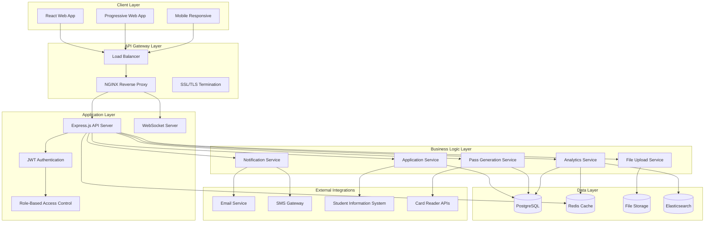

# Technical Architecture & System Design

**Enterprise Student Pass Management System**

## Architecture Overview

The Student Pass Management System follows a modern, scalable microservices-inspired architecture with clear separation of concerns, implementing industry best practices for security, performance, and maintainability.



## Technology Stack

### **Frontend Technologies**
```typescript
{
  "framework": "React 18 with TypeScript",
  "stateManagement": "Redux Toolkit with RTK Query",
  "styling": "Tailwind CSS with Headless UI",
  "charts": "Chart.js with react-chartjs-2",
  "forms": "React Hook Form with Zod validation",
  "routing": "React Router v6",
  "build": "Vite with hot module replacement",
  "testing": "Jest, React Testing Library, MSW",
  "pwa": "Workbox for service workers",
  "accessibility": "ARIA compliant, WCAG 2.1 AA"
}
```

### **Backend Technologies**
```typescript
{
  "runtime": "Node.js 18+ with TypeScript",
  "framework": "Express.js with Helmet security",
  "database": "PostgreSQL 15+ with connection pooling",
  "orm": "Prisma with type-safe queries",
  "cache": "Redis 7+ with clustering support",
  "authentication": "JWT with refresh token rotation",
  "fileStorage": "AWS S3 compatible storage",
  "search": "Elasticsearch for full-text search",
  "queue": "Bull Queue for background jobs",
  "monitoring": "Prometheus metrics with Grafana",
  "logging": "Winston with structured logging",
  "documentation": "OpenAPI 3.0 with Swagger UI"
}
```

### **DevOps & Infrastructure**
```yaml
containerization: Docker with multi-stage builds
orchestration: Kubernetes with auto-scaling
cicd: GitHub Actions with automated testing
monitoring: Prometheus + Grafana + Jaeger
logging: ELK Stack (Elasticsearch, Logstash, Kibana)
security: Trivy container scanning, OWASP ZAP
deployment: Blue-green with rolling updates
backup: Automated PostgreSQL backups to S3
ssl: Let's Encrypt with automatic renewal
cdn: CloudFlare for global content delivery
```

## System Components

### **1. Authentication & Authorization Service**

#### JWT Implementation
```typescript
interface JWTPayload {
  userId: string;
  email: string;
  role: UserRole;
  schoolId?: string;
  permissions: Permission[];
  iat: number;
  exp: number;
  tokenType: 'access' | 'refresh';
}

class AuthenticationService {
  generateTokenPair(user: User): TokenPair {
    const accessToken = jwt.sign(
      { ...payload, tokenType: 'access' },
      config.JWT_SECRET,
      { expiresIn: '15m', issuer: 'student-pass-system' }
    );
    
    const refreshToken = jwt.sign(
      { userId: user.id, tokenType: 'refresh' },
      config.REFRESH_SECRET,
      { expiresIn: '7d', issuer: 'student-pass-system' }
    );
    
    return { accessToken, refreshToken };
  }
}
```

#### Role-Based Access Control (RBAC)
```typescript
enum UserRole {
  SUPER_ADMIN = 'super_admin',
  SCHOOL_ADMIN = 'school_admin',
  STAFF = 'staff',
  SECURITY = 'security',
  STUDENT = 'student'
}

interface Permission {
  resource: string;
  actions: ('create' | 'read' | 'update' | 'delete')[];
  conditions?: Record<string, any>;
}

const ROLE_PERMISSIONS: Record<UserRole, Permission[]> = {
  [UserRole.SUPER_ADMIN]: [
    { resource: '*', actions: ['create', 'read', 'update', 'delete'] }
  ],
  [UserRole.SCHOOL_ADMIN]: [
    { resource: 'students', actions: ['create', 'read', 'update'], conditions: { schoolId: 'own' } },
    { resource: 'applications', actions: ['read', 'update'], conditions: { schoolId: 'own' } },
    { resource: 'passes', actions: ['create', 'read', 'update'], conditions: { schoolId: 'own' } }
  ],
  // ... other roles
};
```

### **2. Application Processing Service**

#### Multi-Step Application Workflow
```typescript
enum ApplicationStatus {
  DRAFT = 'draft',
  SUBMITTED = 'submitted',
  UNDER_REVIEW = 'under_review',
  APPROVED = 'approved',
  REJECTED = 'rejected',
  REQUIRES_DOCUMENTS = 'requires_documents'
}

class ApplicationService {
  async processApplication(applicationId: string): Promise<Application> {
    const application = await this.repository.findById(applicationId);
    
    // Automated validation checks
    const validationResults = await this.validateApplication(application);
    
    if (validationResults.hasErrors) {
      return this.requestAdditionalDocuments(application, validationResults.errors);
    }
    
    // Background verification
    await this.queueBackgroundVerification(application);
    
    return this.updateStatus(application, ApplicationStatus.UNDER_REVIEW);
  }
  
  private async validateApplication(app: Application): Promise<ValidationResult> {
    const checks = [
      this.validateStudentId(app.studentId),
      this.validateDocuments(app.documents),
      this.validateEligibility(app.studentId),
      this.checkDuplicateApplications(app.studentId)
    ];
    
    const results = await Promise.all(checks);
    return this.aggregateValidationResults(results);
  }
}
```

### **3. Pass Generation & QR Code Service**

#### Secure QR Code Implementation
```typescript
interface PassData {
  studentId: string;
  passId: string;
  issueDate: Date;
  expiryDate: Date;
  schoolId: string;
  accessLevel: string;
}

class PassGenerationService {
  async generateSecurePass(studentId: string): Promise<Pass> {
    const student = await this.studentService.findById(studentId);
    const passData: PassData = {
      studentId,
      passId: this.generatePassId(),
      issueDate: new Date(),
      expiryDate: this.calculateExpiryDate(),
      schoolId: student.schoolId,
      accessLevel: student.accessLevel
    };
    
    // Create digitally signed QR code
    const qrCodeData = await this.createSignedQRCode(passData);
    
    // Generate visual pass
    const passImage = await this.generatePassImage(student, qrCodeData);
    
    return this.repository.create({
      ...passData,
      qrCode: qrCodeData,
      imageUrl: passImage.url
    });
  }
  
  private async createSignedQRCode(data: PassData): Promise<string> {
    const payload = {
      ...data,
      timestamp: Date.now(),
      nonce: crypto.randomBytes(16).toString('hex')
    };
    
    const signature = crypto
      .createHmac('sha256', config.QR_SECRET_KEY)
      .update(JSON.stringify(payload))
      .digest('hex');
    
    return JSON.stringify({ ...payload, signature });
  }
  
  async verifyQRCode(qrCodeData: string): Promise<VerificationResult> {
    try {
      const payload = JSON.parse(qrCodeData);
      const { signature, ...data } = payload;
      
      // Verify signature
      const expectedSignature = crypto
        .createHmac('sha256', config.QR_SECRET_KEY)
        .update(JSON.stringify(data))
        .digest('hex');
      
      if (signature !== expectedSignature) {
        return { valid: false, reason: 'Invalid signature' };
      }
      
      // Check expiry
      if (new Date(data.expiryDate) < new Date()) {
        return { valid: false, reason: 'Pass expired' };
      }
      
      // Verify against database
      const pass = await this.repository.findById(data.passId);
      if (!pass || pass.status !== 'active') {
        return { valid: false, reason: 'Pass not found or inactive' };
      }
      
      return { valid: true, passData: data };
    } catch (error) {
      return { valid: false, reason: 'Invalid QR code format' };
    }
  }
}
```

### **4. Real-Time Analytics Service**

#### Advanced Analytics Engine
```typescript
class AnalyticsService {
  constructor(
    private metricsCollector: MetricsCollector,
    private cacheService: CacheService,
    private websocketService: WebSocketService
  ) {}
  
  async getKeyMetrics(filters: AnalyticsFilters): Promise<KeyMetrics> {
    const cacheKey = `metrics:${JSON.stringify(filters)}`;
    let metrics = await this.cacheService.get(cacheKey);
    
    if (!metrics) {
      metrics = await this.calculateKeyMetrics(filters);
      await this.cacheService.set(cacheKey, metrics, 300); // 5 minute cache
    }
    
    return metrics;
  }
  
  private async calculateKeyMetrics(filters: AnalyticsFilters): Promise<KeyMetrics> {
    const [
      totalApplications,
      activeStudents,
      passDistribution,
      accessEvents,
      trends
    ] = await Promise.all([
      this.getTotalApplications(filters),
      this.getActiveStudents(filters),
      this.getPassDistribution(filters),
      this.getRecentAccessEvents(filters),
      this.calculateTrends(filters)
    ]);
    
    return {
      totalApplications,
      activeStudents,
      passDistribution,
      accessEvents,
      trends,
      generatedAt: new Date()
    };
  }
  
  async streamRealTimeUpdates(): Promise<void> {
    // Set up database change listeners
    this.database.onApplicationUpdate((application) => {
      this.websocketService.broadcast('application:updated', application);
      this.invalidateMetricsCache(['applications']);
    });
    
    this.database.onAccessLogCreate((accessLog) => {
      this.websocketService.broadcast('access:logged', accessLog);
      this.invalidateMetricsCache(['access']);
    });
  }
}
```

### **5. File Upload & Management Service**

#### Secure File Handling
```typescript
class FileUploadService {
  private readonly ALLOWED_MIME_TYPES = {
    documents: ['application/pdf', 'image/jpeg', 'image/png'],
    photos: ['image/jpeg', 'image/png', 'image/webp']
  };
  
  async uploadDocument(
    file: Express.Multer.File,
    metadata: FileMetadata
  ): Promise<UploadResult> {
    // Virus scanning
    await this.scanForViruses(file.buffer);
    
    // Validate file type and size
    this.validateFile(file, metadata.type);
    
    // Process image if needed
    const processedFile = await this.processFile(file, metadata);
    
    // Generate secure filename
    const filename = this.generateSecureFilename(file, metadata);
    
    // Upload to S3 with encryption
    const uploadResult = await this.s3Client.upload({
      Bucket: config.S3_BUCKET,
      Key: filename,
      Body: processedFile.buffer,
      ContentType: file.mimetype,
      ServerSideEncryption: 'AES256',
      Metadata: {
        originalName: file.originalname,
        uploadedBy: metadata.userId,
        category: metadata.category
      }
    }).promise();
    
    // Save file record to database
    return this.repository.create({
      originalName: file.originalname,
      filename,
      url: uploadResult.Location,
      size: processedFile.buffer.length,
      mimeType: file.mimetype,
      checksum: this.calculateChecksum(processedFile.buffer),
      metadata
    });
  }
  
  private async processFile(file: Express.Multer.File, metadata: FileMetadata): Promise<ProcessedFile> {
    if (metadata.type === 'photo') {
      // Optimize and resize images
      const buffer = await sharp(file.buffer)
        .resize(800, 800, { fit: 'inside', withoutEnlargement: true })
        .jpeg({ quality: 85 })
        .toBuffer();
      
      return { buffer, processed: true };
    }
    
    return { buffer: file.buffer, processed: false };
  }
}
```

### **6. Notification Service**

#### Multi-Channel Notification System
```typescript
enum NotificationChannel {
  EMAIL = 'email',
  SMS = 'sms',
  PUSH = 'push',
  IN_APP = 'in_app',
  WEBHOOK = 'webhook'
}

class NotificationService {
  private channels: Map<NotificationChannel, NotificationChannel>;
  
  async sendNotification(notification: Notification): Promise<void> {
    const user = await this.userService.findById(notification.userId);
    const preferences = await this.getNotificationPreferences(user.id);
    
    // Determine which channels to use
    const activeChannels = this.getActiveChannels(notification.type, preferences);
    
    // Send notifications concurrently
    const promises = activeChannels.map(channel => 
      this.sendToChannel(channel, notification, user)
    );
    
    await Promise.allSettled(promises);
    
    // Log notification delivery
    await this.logNotification(notification, activeChannels);
  }
  
  private async sendToChannel(
    channel: NotificationChannel,
    notification: Notification,
    user: User
  ): Promise<void> {
    try {
      switch (channel) {
        case NotificationChannel.EMAIL:
          await this.emailService.send({
            to: user.email,
            subject: notification.title,
            template: notification.template,
            data: notification.data
          });
          break;
          
        case NotificationChannel.SMS:
          await this.smsService.send({
            to: user.phone,
            message: notification.message
          });
          break;
          
        case NotificationChannel.IN_APP:
          await this.websocketService.sendToUser(user.id, {
            type: 'notification',
            data: notification
          });
          break;
          
        case NotificationChannel.PUSH:
          await this.pushService.send(user.deviceTokens, {
            title: notification.title,
            body: notification.message,
            data: notification.data
          });
          break;
      }
    } catch (error) {
      this.logger.error(`Failed to send notification via ${channel}`, {
        userId: user.id,
        notificationId: notification.id,
        error: error.message
      });
    }
  }
}
```

## Database Design

### **Schema Architecture**
```sql
-- Core Tables
CREATE TABLE users (
    id UUID PRIMARY KEY DEFAULT gen_random_uuid(),
    email VARCHAR(255) UNIQUE NOT NULL,
    password_hash VARCHAR(255) NOT NULL,
    role user_role NOT NULL,
    first_name VARCHAR(100) NOT NULL,
    last_name VARCHAR(100) NOT NULL,
    is_active BOOLEAN DEFAULT true,
    school_id UUID REFERENCES schools(id),
    created_at TIMESTAMP DEFAULT CURRENT_TIMESTAMP,
    updated_at TIMESTAMP DEFAULT CURRENT_TIMESTAMP
);

CREATE TABLE students (
    id UUID PRIMARY KEY DEFAULT gen_random_uuid(),
    student_id VARCHAR(50) UNIQUE NOT NULL,
    email VARCHAR(255) UNIQUE,
    first_name VARCHAR(100) NOT NULL,
    last_name VARCHAR(100) NOT NULL,
    date_of_birth DATE,
    phone VARCHAR(20),
    school_id UUID REFERENCES schools(id) NOT NULL,
    department_id UUID REFERENCES departments(id),
    enrollment_date DATE,
    status student_status DEFAULT 'active',
    created_at TIMESTAMP DEFAULT CURRENT_TIMESTAMP,
    updated_at TIMESTAMP DEFAULT CURRENT_TIMESTAMP,
    deleted_at TIMESTAMP
);

CREATE TABLE applications (
    id UUID PRIMARY KEY DEFAULT gen_random_uuid(),
    student_id UUID REFERENCES students(id),
    status application_status DEFAULT 'draft',
    submitted_at TIMESTAMP,
    reviewed_at TIMESTAMP,
    reviewed_by UUID REFERENCES users(id),
    data JSONB NOT NULL,
    created_at TIMESTAMP DEFAULT CURRENT_TIMESTAMP,
    updated_at TIMESTAMP DEFAULT CURRENT_TIMESTAMP
);

CREATE TABLE passes (
    id UUID PRIMARY KEY DEFAULT gen_random_uuid(),
    student_id UUID REFERENCES students(id) NOT NULL,
    pass_number VARCHAR(50) UNIQUE NOT NULL,
    qr_code TEXT NOT NULL,
    issue_date DATE NOT NULL,
    expiry_date DATE NOT NULL,
    status pass_status DEFAULT 'active',
    issued_by UUID REFERENCES users(id),
    created_at TIMESTAMP DEFAULT CURRENT_TIMESTAMP,
    updated_at TIMESTAMP DEFAULT CURRENT_TIMESTAMP
);

CREATE TABLE access_logs (
    id UUID PRIMARY KEY DEFAULT gen_random_uuid(),
    student_id UUID REFERENCES students(id),
    pass_id UUID REFERENCES passes(id),
    access_point_id UUID REFERENCES access_points(id),
    access_time TIMESTAMP DEFAULT CURRENT_TIMESTAMP,
    access_type access_type,
    status access_status,
    reason VARCHAR(255),
    device_info JSONB,
    created_at TIMESTAMP DEFAULT CURRENT_TIMESTAMP
);
```

### **Performance Optimizations**
```sql
-- Strategic Indexes
CREATE INDEX CONCURRENTLY idx_students_school_id ON students(school_id) WHERE deleted_at IS NULL;
CREATE INDEX CONCURRENTLY idx_students_status ON students(status) WHERE deleted_at IS NULL;
CREATE INDEX CONCURRENTLY idx_applications_status ON applications(status);
CREATE INDEX CONCURRENTLY idx_applications_submitted_at ON applications(submitted_at);
CREATE INDEX CONCURRENTLY idx_passes_student_id ON passes(student_id);
CREATE INDEX CONCURRENTLY idx_passes_status_expiry ON passes(status, expiry_date);
CREATE INDEX CONCURRENTLY idx_access_logs_time ON access_logs(access_time DESC);
CREATE INDEX CONCURRENTLY idx_access_logs_student_id ON access_logs(student_id);

-- Partial Indexes for Active Records
CREATE INDEX CONCURRENTLY idx_active_passes ON passes(student_id) WHERE status = 'active';
CREATE INDEX CONCURRENTLY idx_pending_applications ON applications(submitted_at) WHERE status IN ('submitted', 'under_review');

-- Composite Indexes for Complex Queries
CREATE INDEX CONCURRENTLY idx_access_logs_student_time ON access_logs(student_id, access_time DESC);
CREATE INDEX CONCURRENTLY idx_applications_school_status ON applications(school_id, status, submitted_at DESC);
```

### **Data Partitioning Strategy**
```sql
-- Partition access_logs by month for better performance
CREATE TABLE access_logs_template (LIKE access_logs INCLUDING ALL);

CREATE TABLE access_logs_2024_01 PARTITION OF access_logs_template
FOR VALUES FROM ('2024-01-01') TO ('2024-02-01');

CREATE TABLE access_logs_2024_02 PARTITION OF access_logs_template
FOR VALUES FROM ('2024-02-01') TO ('2024-03-01');

-- Automated partition management
CREATE OR REPLACE FUNCTION create_monthly_partition()
RETURNS void AS $$
DECLARE
    partition_date DATE;
    partition_name TEXT;
BEGIN
    partition_date := date_trunc('month', CURRENT_DATE + interval '1 month');
    partition_name := 'access_logs_' || to_char(partition_date, 'YYYY_MM');
    
    EXECUTE format('CREATE TABLE %I PARTITION OF access_logs_template FOR VALUES FROM (%L) TO (%L)',
                   partition_name,
                   partition_date,
                   partition_date + interval '1 month');
END;
$$ LANGUAGE plpgsql;
```

## API Design & Documentation

### **RESTful API Standards**
```typescript
// Consistent API Response Format
interface ApiResponse<T = any> {
  success: boolean;
  data?: T;
  error?: string;
  message?: string;
  metadata?: {
    timestamp: string;
    requestId: string;
    pagination?: PaginationMetadata;
  };
}

// Standardized Error Responses
interface ApiError {
  code: string;
  message: string;
  details?: any[];
  path: string;
  timestamp: string;
  requestId: string;
}
```

### **Core API Endpoints**

#### Authentication Endpoints
```yaml
POST /api/v1/auth/login:
  description: User authentication
  requestBody:
    required: true
    content:
      application/json:
        schema:
          type: object
          properties:
            email:
              type: string
              format: email
            password:
              type: string
              minLength: 8
            rememberMe:
              type: boolean
  responses:
    200:
      description: Authentication successful
      content:
        application/json:
          schema:
            type: object
            properties:
              success:
                type: boolean
              data:
                type: object
                properties:
                  user:
                    $ref: '#/components/schemas/User'
                  tokens:
                    $ref: '#/components/schemas/TokenPair'
```

#### Student Management Endpoints
```yaml
GET /api/v1/students:
  description: List students with filtering and pagination
  parameters:
    - name: page
      in: query
      schema:
        type: integer
        minimum: 1
    - name: limit
      in: query
      schema:
        type: integer
        minimum: 1
        maximum: 100
    - name: search
      in: query
      schema:
        type: string
    - name: status
      in: query
      schema:
        type: string
        enum: [active, inactive, graduated, suspended]
    - name: schoolId
      in: query
      schema:
        type: string
        format: uuid
  responses:
    200:
      description: Students retrieved successfully
      content:
        application/json:
          schema:
            type: object
            properties:
              success:
                type: boolean
              data:
                type: object
                properties:
                  students:
                    type: array
                    items:
                      $ref: '#/components/schemas/Student'
                  pagination:
                    $ref: '#/components/schemas/PaginationMetadata'
```

### **GraphQL API Integration**
```typescript
// GraphQL Schema Definition
const typeDefs = gql`
  type Student {
    id: ID!
    studentId: String!
    firstName: String!
    lastName: String!
    email: String
    phone: String
    school: School!
    department: Department
    status: StudentStatus!
    passes: [Pass!]!
    applications: [Application!]!
    createdAt: DateTime!
    updatedAt: DateTime!
  }
  
  type Query {
    students(
      filters: StudentFilters
      pagination: PaginationInput
    ): StudentsResponse!
    
    student(id: ID!): Student
    
    analytics(
      filters: AnalyticsFilters
      dateRange: DateRangeInput
    ): AnalyticsData!
  }
  
  type Mutation {
    createStudent(input: CreateStudentInput!): Student!
    updateStudent(id: ID!, input: UpdateStudentInput!): Student!
    deleteStudent(id: ID!): Boolean!
  }
  
  type Subscription {
    applicationUpdated(studentId: ID): Application!
    accessLogged: AccessLog!
    systemMetricsUpdated: SystemMetrics!
  }
`;

// Resolvers with DataLoader for N+1 prevention
const resolvers = {
  Query: {
    students: async (_, { filters, pagination }, { dataSources, user }) => {
      // Check permissions
      await checkPermission(user, 'students', 'read');
      
      return dataSources.studentAPI.getStudents(filters, pagination);
    }
  },
  
  Student: {
    school: (student, _, { loaders }) => 
      loaders.schoolLoader.load(student.schoolId),
    
    passes: (student, _, { loaders }) =>
      loaders.passLoader.loadMany(student.id),
  },
  
  Subscription: {
    applicationUpdated: {
      subscribe: withFilter(
        () => pubsub.asyncIterator(['APPLICATION_UPDATED']),
        (payload, variables) => {
          return !variables.studentId || payload.studentId === variables.studentId;
        }
      )
    }
  }
};
```

## Security Architecture

### **Security Layers**
```typescript
// 1. Network Security
const securityMiddleware = [
  helmet({
    contentSecurityPolicy: {
      directives: {
        defaultSrc: ["'self'"],
        styleSrc: ["'self'", "'unsafe-inline'"],
        scriptSrc: ["'self'"],
        imgSrc: ["'self'", "data:", "https:"],
        connectSrc: ["'self'", "wss:"],
        fontSrc: ["'self'"],
        objectSrc: ["'none'"],
        mediaSrc: ["'self'"],
        frameSrc: ["'none'"]
      }
    },
    hsts: {
      maxAge: 31536000,
      includeSubDomains: true,
      preload: true
    }
  }),
  
  cors({
    origin: process.env.ALLOWED_ORIGINS?.split(',') || [],
    credentials: true,
    methods: ['GET', 'POST', 'PUT', 'DELETE', 'PATCH'],
    allowedHeaders: ['Content-Type', 'Authorization', 'X-Request-ID']
  }),
  
  rateLimit({
    windowMs: 15 * 60 * 1000, // 15 minutes
    max: 100, // Limit each IP to 100 requests per windowMs
    message: 'Too many requests from this IP',
    standardHeaders: true,
    legacyHeaders: false
  })
];

// 2. Input Validation & Sanitization
const validationSchemas = {
  createStudent: z.object({
    studentId: z.string().min(3).max(50).regex(/^[a-zA-Z0-9-]+$/),
    firstName: z.string().min(1).max(100).regex(/^[a-zA-ZÀ-ÿ\s]+$/),
    lastName: z.string().min(1).max(100).regex(/^[a-zA-ZÀ-ÿ\s]+$/),
    email: z.string().email().optional(),
    phone: z.string().regex(/^\+?[1-9]\d{1,14}$/).optional(),
    dateOfBirth: z.string().datetime().optional()
  })
};

// 3. Authentication & Authorization
class SecurityService {
  async validateToken(token: string): Promise<User | null> {
    try {
      const decoded = jwt.verify(token, config.JWT_SECRET) as JWTPayload;
      
      // Check if token is revoked
      const isRevoked = await this.isTokenRevoked(decoded.jti);
      if (isRevoked) return null;
      
      // Validate user is still active
      const user = await this.userService.findById(decoded.userId);
      if (!user || !user.isActive) return null;
      
      return user;
    } catch (error) {
      return null;
    }
  }
  
  async checkPermission(user: User, resource: string, action: string): Promise<boolean> {
    const permissions = await this.getUserPermissions(user);
    
    return permissions.some(permission => 
      (permission.resource === '*' || permission.resource === resource) &&
      permission.actions.includes(action)
    );
  }
}
```

### **Data Encryption & Protection**
```typescript
// Encryption at Rest
class EncryptionService {
  private readonly algorithm = 'aes-256-gcm';
  
  encrypt(plaintext: string, key: string): EncryptedData {
    const iv = crypto.randomBytes(16);
    const cipher = crypto.createCipher(this.algorithm, key);
    cipher.setAAD(Buffer.from('student-pass-system'));
    
    let encrypted = cipher.update(plaintext, 'utf8', 'hex');
    encrypted += cipher.final('hex');
    
    const authTag = cipher.getAuthTag();
    
    return {
      encrypted,
      iv: iv.toString('hex'),
      authTag: authTag.toString('hex')
    };
  }
  
  decrypt(encryptedData: EncryptedData, key: string): string {
    const decipher = crypto.createDecipher(this.algorithm, key);
    decipher.setAAD(Buffer.from('student-pass-system'));
    decipher.setAuthTag(Buffer.from(encryptedData.authTag, 'hex'));
    
    let decrypted = decipher.update(encryptedData.encrypted, 'hex', 'utf8');
    decrypted += decipher.final('utf8');
    
    return decrypted;
  }
}

// PII Data Handling
class PIIProtection {
  private sensitiveFields = ['ssn', 'dateOfBirth', 'phone', 'address'];
  
  async encryptSensitiveData(data: any): Promise<any> {
    const result = { ...data };
    
    for (const field of this.sensitiveFields) {
      if (result[field]) {
        result[field] = await this.encryptionService.encrypt(
          result[field],
          config.DATA_ENCRYPTION_KEY
        );
      }
    }
    
    return result;
  }
  
  async decryptSensitiveData(data: any, userPermissions: Permission[]): Promise<any> {
    const canViewPII = userPermissions.some(p => 
      p.resource === 'pii' && p.actions.includes('read')
    );
    
    if (!canViewPII) {
      // Return masked data
      return this.maskSensitiveFields(data);
    }
    
    // Decrypt for authorized users
    const result = { ...data };
    for (const field of this.sensitiveFields) {
      if (result[field] && typeof result[field] === 'object') {
        result[field] = await this.encryptionService.decrypt(
          result[field],
          config.DATA_ENCRYPTION_KEY
        );
      }
    }
    
    return result;
  }
}
```

## Performance & Scalability

### **Caching Strategy**
```typescript
// Multi-Level Caching Implementation
class CacheService {
  constructor(
    private memoryCache: NodeCache,
    private redisClient: Redis,
    private cdnCache: CloudFlareAPI
  ) {}
  
  async get(key: string, options: CacheOptions = {}): Promise<any> {
    const { ttl = 3600, level = 'all' } = options;
    
    // L1 Cache: Memory (fastest)
    if (level === 'all' || level === 'memory') {
      const memoryResult = this.memoryCache.get(key);
      if (memoryResult !== undefined) {
        this.recordCacheHit('memory', key);
        return memoryResult;
      }
    }
    
    // L2 Cache: Redis (fast)
    if (level === 'all' || level === 'redis') {
      const redisResult = await this.redisClient.get(key);
      if (redisResult) {
        const parsed = JSON.parse(redisResult);
        
        // Populate L1 cache
        this.memoryCache.set(key, parsed, Math.min(ttl, 300));
        this.recordCacheHit('redis', key);
        
        return parsed;
      }
    }
    
    this.recordCacheMiss(key);
    return null;
  }
  
  async set(key: string, value: any, options: CacheOptions = {}): Promise<void> {
    const { ttl = 3600, level = 'all' } = options;
    
    if (level === 'all' || level === 'memory') {
      this.memoryCache.set(key, value, Math.min(ttl, 300));
    }
    
    if (level === 'all' || level === 'redis') {
      await this.redisClient.setex(key, ttl, JSON.stringify(value));
    }
    
    // CDN cache for static content
    if (options.cdnCacheable) {
      await this.cdnCache.purge(key);
    }
  }
  
  async invalidate(patterns: string[]): Promise<void> {
    // Invalidate memory cache
    const memoryKeys = this.memoryCache.keys();
    for (const pattern of patterns) {
      const regex = new RegExp(pattern.replace('*', '.*'));
      memoryKeys.filter(key => regex.test(key)).forEach(key => {
        this.memoryCache.del(key);
      });
    }
    
    // Invalidate Redis cache
    for (const pattern of patterns) {
      const keys = await this.redisClient.keys(pattern);
      if (keys.length > 0) {
        await this.redisClient.del(...keys);
      }
    }
  }
}
```

### **Database Query Optimization**
```typescript
// Query Builder with Automatic Optimization
class OptimizedQueryBuilder {
  private query: any;
  private includes: string[] = [];
  private selectFields: string[] = [];
  
  select(fields: string[]): this {
    this.selectFields = fields;
    return this;
  }
  
  include(relation: string): this {
    this.includes.push(relation);
    return this;
  }
  
  async execute(): Promise<any> {
    // Analyze query complexity
    const complexity = this.analyzeComplexity();
    
    if (complexity.score > 0.8) {
      // Use read replica for complex queries
      this.query = this.query.usingDatabase('read-replica');
    }
    
    // Add selective loading
    if (this.selectFields.length > 0) {
      this.query = this.query.select(this.selectFields);
    }
    
    // Optimize includes with batch loading
    if (this.includes.length > 0) {
      const batchIncludes = this.optimizeIncludes(this.includes);
      this.query = this.query.include(batchIncludes);
    }
    
    // Execute with performance monitoring
    const startTime = Date.now();
    const result = await this.query;
    const duration = Date.now() - startTime;
    
    // Log slow queries
    if (duration > 1000) {
      this.logger.warn('Slow query detected', {
        duration,
        query: this.query.toSQL(),
        complexity: complexity.score
      });
    }
    
    return result;
  }
  
  private analyzeComplexity(): { score: number; factors: string[] } {
    let score = 0;
    const factors: string[] = [];
    
    if (this.includes.length > 3) {
      score += 0.3;
      factors.push('many-includes');
    }
    
    if (this.selectFields.length === 0) {
      score += 0.2;
      factors.push('select-all');
    }
    
    return { score, factors };
  }
}
```

### **Background Job Processing**
```typescript
// Queue-based Background Processing
class BackgroundJobService {
  private queues: Map<string, Queue> = new Map();
  
  constructor() {
    this.setupQueues();
    this.setupWorkers();
  }
  
  private setupQueues(): void {
    const queueConfigs = [
      { name: 'email', concurrency: 10, priority: 'normal' },
      { name: 'file-processing', concurrency: 5, priority: 'low' },
      { name: 'analytics', concurrency: 3, priority: 'low' },
      { name: 'notifications', concurrency: 20, priority: 'high' }
    ];
    
    for (const config of queueConfigs) {
      const queue = new Queue(config.name, {
        redis: config.redis,
        defaultJobOptions: {
          removeOnComplete: 100,
          removeOnFail: 50,
          attempts: 3,
          backoff: {
            type: 'exponential',
            delay: 2000
          }
        }
      });
      
      this.queues.set(config.name, queue);
    }
  }
  
  private setupWorkers(): void {
    // Email worker
    this.queues.get('email')!.process('send-email', 10, async (job) => {
      const { to, subject, template, data } = job.data;
      await this.emailService.send({ to, subject, template, data });
    });
    
    // File processing worker
    this.queues.get('file-processing')!.process('process-image', 5, async (job) => {
      const { fileId, transformations } = job.data;
      await this.fileService.processImage(fileId, transformations);
    });
    
    // Analytics worker
    this.queues.get('analytics')!.process('calculate-metrics', 3, async (job) => {
      const { dateRange, filters } = job.data;
      await this.analyticsService.calculateAndCacheMetrics(dateRange, filters);
    });
  }
  
  async addJob(queueName: string, jobName: string, data: any, options: any = {}): Promise<void> {
    const queue = this.queues.get(queueName);
    if (!queue) throw new Error(`Queue ${queueName} not found`);
    
    await queue.add(jobName, data, {
      priority: options.priority || 0,
      delay: options.delay || 0,
      repeat: options.repeat
    });
  }
}
```

## Monitoring & Observability

### **Application Performance Monitoring (APM)**
```typescript
// Custom Metrics Collection
class MetricsService {
  private prometheus = require('prom-client');
  
  constructor() {
    this.setupMetrics();
  }
  
  private setupMetrics(): void {
    // HTTP Request Metrics
    this.httpRequestDuration = new this.prometheus.Histogram({
      name: 'http_request_duration_seconds',
      help: 'Duration of HTTP requests in seconds',
      labelNames: ['method', 'route', 'status_code'],
      buckets: [0.1, 0.3, 0.5, 0.7, 1, 3, 5, 7, 10]
    });
    
    // Database Query Metrics
    this.dbQueryDuration = new this.prometheus.Histogram({
      name: 'db_query_duration_seconds',
      help: 'Duration of database queries in seconds',
      labelNames: ['operation', 'table'],
      buckets: [0.01, 0.05, 0.1, 0.5, 1, 2, 5]
    });
    
    // Cache Hit Rate
    this.cacheHitRate = new this.prometheus.Gauge({
      name: 'cache_hit_rate',
      help: 'Cache hit rate percentage',
      labelNames: ['cache_type', 'key_pattern']
    });
    
    // Active Users
    this.activeUsers = new this.prometheus.Gauge({
      name: 'active_users_total',
      help: 'Number of currently active users',
      labelNames: ['user_type']
    });
    
    // Application Metrics
    this.applicationProcessingTime = new this.prometheus.Histogram({
      name: 'application_processing_duration_seconds',
      help: 'Time taken to process applications',
      labelNames: ['status', 'school_id']
    });
  }
  
  recordHttpRequest(req: Request, res: Response, duration: number): void {
    this.httpRequestDuration
      .labels(req.method, req.route?.path || 'unknown', res.statusCode.toString())
      .observe(duration / 1000);
  }
  
  recordDbQuery(operation: string, table: string, duration: number): void {
    this.dbQueryDuration
      .labels(operation, table)
      .observe(duration / 1000);
  }
}
```

### **Health Checks & Circuit Breakers**
```typescript
// Health Check System
class HealthCheckService {
  private checks: Map<string, HealthCheck> = new Map();
  
  registerCheck(name: string, check: HealthCheck): void {
    this.checks.set(name, check);
  }
  
  async runAllChecks(): Promise<HealthStatus> {
    const results = new Map<string, HealthCheckResult>();
    let overallStatus: 'healthy' | 'degraded' | 'unhealthy' = 'healthy';
    
    for (const [name, check] of this.checks) {
      try {
        const startTime = Date.now();
        const result = await Promise.race([
          check.execute(),
          this.timeout(check.timeout || 5000)
        ]);
        
        results.set(name, {
          status: 'healthy',
          responseTime: Date.now() - startTime,
          message: result.message
        });
      } catch (error) {
        results.set(name, {
          status: 'unhealthy',
          message: error.message,
          error: error.stack
        });
        
        if (check.critical) {
          overallStatus = 'unhealthy';
        } else if (overallStatus !== 'unhealthy') {
          overallStatus = 'degraded';
        }
      }
    }
    
    return {
      status: overallStatus,
      timestamp: new Date().toISOString(),
      checks: Object.fromEntries(results),
      version: process.env.APP_VERSION,
      uptime: process.uptime()
    };
  }
}

// Circuit Breaker Implementation
class CircuitBreaker {
  private state: 'CLOSED' | 'OPEN' | 'HALF_OPEN' = 'CLOSED';
  private failureCount = 0;
  private lastFailureTime = 0;
  private successCount = 0;
  
  constructor(
    private options: {
      failureThreshold: number;
      timeout: number;
      monitoringPeriod: number;
    }
  ) {}
  
  async execute<T>(operation: () => Promise<T>): Promise<T> {
    if (this.state === 'OPEN') {
      if (Date.now() - this.lastFailureTime >= this.options.timeout) {
        this.state = 'HALF_OPEN';
        this.successCount = 0;
      } else {
        throw new Error('Circuit breaker is OPEN');
      }
    }
    
    try {
      const result = await operation();
      
      if (this.state === 'HALF_OPEN') {
        this.successCount++;
        if (this.successCount >= 3) {
          this.reset();
        }
      }
      
      return result;
    } catch (error) {
      this.recordFailure();
      throw error;
    }
  }
  
  private recordFailure(): void {
    this.failureCount++;
    this.lastFailureTime = Date.now();
    
    if (this.failureCount >= this.options.failureThreshold) {
      this.state = 'OPEN';
    }
  }
  
  private reset(): void {
    this.state = 'CLOSED';
    this.failureCount = 0;
    this.successCount = 0;
  }
}
```

## Deployment Architecture

### **Container Configuration**
```dockerfile
# Multi-stage Docker build
FROM node:18-alpine AS base
RUN apk add --no-cache dumb-init
WORKDIR /app
COPY package*.json ./
RUN npm ci --only=production && npm cache clean --force

FROM node:18-alpine AS build
WORKDIR /app
COPY package*.json ./
RUN npm ci
COPY . .
RUN npm run build

FROM base AS runtime
ENV NODE_ENV=production
USER node
COPY --from=build --chown=node:node /app/dist ./dist
COPY --from=build --chown=node:node /app/package*.json ./
EXPOSE 3000
ENTRYPOINT ["dumb-init", "--"]
CMD ["node", "dist/server.js"]
```

### **Kubernetes Deployment**
```yaml
# Production Kubernetes Configuration
apiVersion: apps/v1
kind: Deployment
metadata:
  name: student-pass-api
  labels:
    app: student-pass-api
    version: v1.0.0
spec:
  replicas: 3
  strategy:
    type: RollingUpdate
    rollingUpdate:
      maxSurge: 1
      maxUnavailable: 0
  selector:
    matchLabels:
      app: student-pass-api
  template:
    metadata:
      labels:
        app: student-pass-api
        version: v1.0.0
    spec:
      containers:
      - name: api
        image: student-pass-api:v1.0.0
        ports:
        - containerPort: 3000
          name: http
        env:
        - name: NODE_ENV
          value: "production"
        - name: DATABASE_URL
          valueFrom:
            secretKeyRef:
              name: database-secret
              key: url
        - name: REDIS_URL
          valueFrom:
            secretKeyRef:
              name: redis-secret
              key: url
        resources:
          requests:
            memory: "256Mi"
            cpu: "250m"
          limits:
            memory: "512Mi"
            cpu: "500m"
        livenessProbe:
          httpGet:
            path: /api/health
            port: http
          initialDelaySeconds: 30
          periodSeconds: 10
          timeoutSeconds: 5
          failureThreshold: 3
        readinessProbe:
          httpGet:
            path: /api/health/ready
            port: http
          initialDelaySeconds: 5
          periodSeconds: 5
          timeoutSeconds: 3
          failureThreshold: 2
        securityContext:
          runAsNonRoot: true
          runAsUser: 1001
          allowPrivilegeEscalation: false
          capabilities:
            drop:
            - ALL
          readOnlyRootFilesystem: true
        volumeMounts:
        - name: tmp
          mountPath: /tmp
        - name: cache
          mountPath: /app/.cache
      volumes:
      - name: tmp
        emptyDir: {}
      - name: cache
        emptyDir: {}
      affinity:
        podAntiAffinity:
          preferredDuringSchedulingIgnoredDuringExecution:
          - weight: 100
            podAffinityTerm:
              labelSelector:
                matchExpressions:
                - key: app
                  operator: In
                  values:
                  - student-pass-api
              topologyKey: kubernetes.io/hostname
```

### **Infrastructure as Code (Terraform)**
```hcl
# AWS Infrastructure Configuration
resource "aws_ecs_cluster" "main" {
  name = "student-pass-cluster"
  
  setting {
    name  = "containerInsights"
    value = "enabled"
  }
  
  tags = {
    Environment = var.environment
    Project     = "student-pass-system"
  }
}

resource "aws_rds_instance" "postgres" {
  identifier = "student-pass-db"
  
  engine         = "postgres"
  engine_version = "15.4"
  instance_class = "db.r6g.large"
  
  allocated_storage     = 100
  max_allocated_storage = 1000
  storage_type         = "gp3"
  storage_encrypted    = true
  
  db_name  = "student_pass_db"
  username = var.db_username
  password = var.db_password
  
  vpc_security_group_ids = [aws_security_group.rds.id]
  db_subnet_group_name   = aws_db_subnet_group.main.name
  
  backup_retention_period = 30
  backup_window          = "03:00-04:00"
  maintenance_window     = "sun:04:00-sun:05:00"
  
  performance_insights_enabled = true
  monitoring_interval         = 60
  monitoring_role_arn        = aws_iam_role.rds_monitoring.arn
  
  skip_final_snapshot       = false
  final_snapshot_identifier = "student-pass-final-${formatdate("YYYY-MM-DD-hhmm", timestamp())}"
  
  tags = {
    Environment = var.environment
    Project     = "student-pass-system"
  }
}

resource "aws_elasticache_replication_group" "redis" {
  replication_group_id       = "student-pass-redis"
  description                = "Redis cluster for Student Pass System"
  
  node_type                  = "cache.r6g.large"
  port                       = 6379
  parameter_group_name       = "default.redis7"
  
  num_cache_clusters         = 3
  automatic_failover_enabled = true
  multi_az_enabled          = true
  
  subnet_group_name = aws_elasticache_subnet_group.main.name
  security_group_ids = [aws_security_group.redis.id]
  
  at_rest_encryption_enabled = true
  transit_encryption_enabled = true
  auth_token                = var.redis_auth_token
  
  tags = {
    Environment = var.environment
    Project     = "student-pass-system"
  }
}
```

This comprehensive technical architecture documentation provides a complete overview of the Student Pass Management System's design, implementation, and deployment strategies. The system is built with enterprise-grade standards, ensuring scalability, security, and maintainability for production environments.